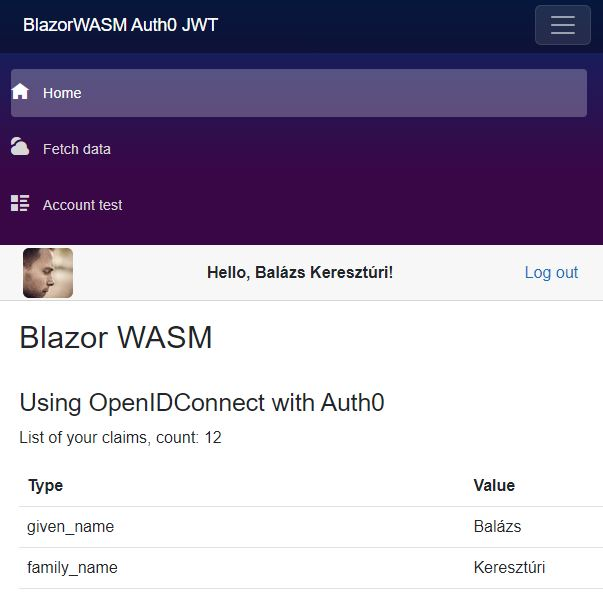

# BlazorWASM Auth0 JWT OpenIDConnect

An example of using [Auth0](https://auth0.com) with OpenIDConnect in a Blazor WebAssembly application.

The solution was created using the default Blazor WASM template. The client is customized for OpenIDConnect using Auth0. Server is configured for JWT token issued by Auth0.

*NOTE:* Auth0 has created some [templates](https://github.com/auth0/auth0-dotnet-templates) to create new projects tailored for Auth0 authentication.

You can compare this solution with [Blazor WASM BFF architecture](../BlazorWASM.BFF.Auth0.OpenIDConnect).

## Deviation from the default template

A few changes had to be applied to make it work:

- Client
  - Program.cs: using AddOidcAuthentication and AddAuthorizationCore instead of AddApiAuthorization
  - Authentication.razor: Replace the default LogOut in the RemoteAuthenticatorView
- Server
  - Program.cs: using AddJwtBearer instead of the IdentityServer

## Prerequisite to run the application

- Auth0 account #1: create a SPA application
  - Allowed Callback URL: https://localhost:7209/authentication/login-callback
    - Swagger Oauth flow callback URL: https://localhost:7209/swagger/oauth2-redirect.html
  - Allowed Logout URL: https://localhost:7209
- Auth0 account #2: create a custom API, the value of identifier will be used as the audience parameter on authorization calls
- [Social connections](https://marketplace.auth0.com/features/social-connections) can be added with the redirect URL: https://Your-Auth0-Domain/login/callback
- Client/wwwroot/appsettings.json

```json
"OidcConfig": {
    "Authority": "Your SPA Domain",
    "ClientId": "Your SPA ClientId",
    "MetadataUrl": "Your SPA Domain/.well-known/openid-configuration",
    "Audience": "Your Custom API identifier"
}
```
- Server/appsettings.json

```json
"OidcConfig": {
    "Authority": "Your SPA Domain",
    "ClientId": "Not used",
    "MetadataUrl": "Your SPA Domain/.well-known/openid-configuration",
    "Audience": "Your Custom API identifier"
}
```

## Auth0 - Custom Action

- Add this custom action to the login flow

```js
exports.onExecutePostLogin = async (event, api) => {
  if (event.authorization)
  {
    // Difference between ID Token and Access Token
    // - Blog:  https://auth0.com/blog/id-token-access-token-what-is-the-difference
    // - Video: https://youtu.be/vVM1Tpu9QB4

    // ID Token is used by the Blazor frontend
    api.idToken.setCustomClaim("role", event.authorization.roles);
    
    // Access Token is passed to the API server by the Blazor frontend
    // Permissions are included in the token by default
    api.accessToken.setCustomClaim("role", event.authorization.roles);
    api.accessToken.setCustomClaim("email", event.user.email);
  }
};
```

## Resources

- [Configure ASP.NET Web API for JWT](https://auth0.com/docs/quickstart/backend/aspnet-core-webapi) 📓*Auth0 Docs*
- [Auth0 in ASP.NET + Blazor WASM](https://timmoth.com/posts/H9zMzMcBkUe_QfCAo0kx_Q) 📓*Tim*
- [OpenIddict](https://documentation.openiddict.com) 📓*Official doc*
- [OpenIddict-Core](https://github.com/openiddict/openiddict-core) 👤*Official repo*
- [Auth0 - Social Connections](https://marketplace.auth0.com/features/social-connections) 📓*Auth0 doc*
- [Auth0 Templates for .NET](https://github.com/auth0/auth0-dotnet-templates) 👤*Auth0*
- [Blazor WASM with Google authorization](https://www.telerik.com/blogs/create-webassembly-app-blazor-google-authorization) 📓*Telerik-Blogs*
- .NET MAUI
  - [Auth0 Authentication to Blazor Hybrid Apps in .NET MAUI](https://auth0.com/blog/add-authentication-to-blazor-hybrid-apps-in-dotnet-maui) 📓*Auth0 Blog - Andrea Chiarelli*
  - [Managing Tokens in .NET MAUI](https://auth0.com/blog/managing-tokens-in-dotnet-maui/) 📓*Auth0 Blog - Andrea Chiarelli*

