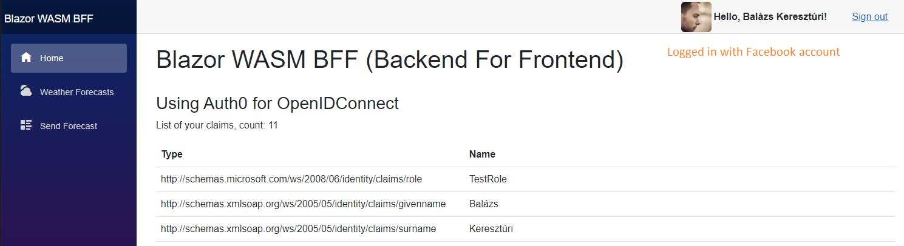

# BlazorWASM.BFF.Auth0.OpenIDConnect

An example of using [Auth0](https://auth0.com) with OpenIDConnect in a Blazor WebAssembly application that has a Backend For Frontend (BFF) architecture.

[Damien’s template](https://github.com/damienbod/Blazor.BFF.OpenIDConnect.Template) is used to create 3 projects: Client, Server and Shared and customized for Auth0.

You can compare this solution with [Blazor WASM JWT OpenIDConnect](../BlazorWASM.Auth0.JWT.OpenIDConnect).

###### Prerequisite to run the application

- Auth0 account, where the SPA Application is configured
  - Allowed Callback URLs: https://localhost:5301/callback
  - Allowed Logout URLs: https://localhost:5301
- [Social connections](https://marketplace.auth0.com/features/social-connections) can be added with the redirect URL: https://YOUR_DOMAIN/login/callback
- appsettings.json

```json
"Authentication": {
  "Auth0": {
    "Domain": "Your Auth0 Domain",
    "ClientId": "Your Auth0 Application's ClientId"
  }
}
```

###### Resources

- [Blazor.BFF.OpenIDConnect.Template](https://github.com/damienbod/Blazor.BFF.OpenIDConnect.Template) 👤*DamienBod* - This template is used and customized for Auth0
- [Overview of different App security topics](https://github.com/damienbod/aspnetcore-standup-authn-authz) 👤*DamienBod*
- [Exploring the Auth0 ASP.NET Authentication SDK](https://auth0.com/blog/exploring-auth0-aspnet-core-authentication-sdk) 📓*Auth0 blog - Andrea Chiarelli*
- [Let's make our SPA more secure by setting up a .NET BFF with Duende and Auth0](https://timdeschryver.dev/blog/lets-make-our-spa-more-secure-by-setting-up-a-net-bff-with-duende-and-auth0) 📓*Tim Deschryver*
- [OpenIddict](https://documentation.openiddict.com) 📓*Official doc*
- [OpenIddict-Core](https://github.com/openiddict/openiddict-core) 👤*Official repo*
- [Auth0 - Social Connections](https://marketplace.auth0.com/features/social-connections) 📓*Auth0 doc*
- [Configure Auth0 in ASP.NET application with cookies](https://auth0.com/docs/quickstart/webapp/aspnet-core) 📓*Auth0 doc*
- [Blazor Server app using OpenIdConnect with Auth0](https://andrewlock.net/adding-authentication-to-a-blazor-server-app-using-auth0) 📓*Andrew Lock*
- [How to use OAuth - Authorization Code Flow](https://dotneteers.net/how-to-use-c-to-properly-follow-oauth-authentication-flows/) 📓*Dotneteers* - using the [IdentityModel](https://www.nuget.org/packages/IdentityModel) package
- [Blazor BFF with MS Entra ID as Identity provider](https://techcommunity.microsoft.com/t5/microsoft-developer-community/implementing-a-blazor-based-bff-in-azure-container-apps/ba-p/4111208) 📓*MS-Techcommunity*
- OWASP security headers
  - [NetEscapades.AspNetCore.SecurityHeaders](https://github.com/andrewlock/NetEscapades.AspNetCore.SecurityHeaders) 👤*Andrew Lock*
  - [OwaspHeaders.Core](https://github.com/GaProgMan/OwaspHeaders.Core) 👤*Jamie Taylor*

